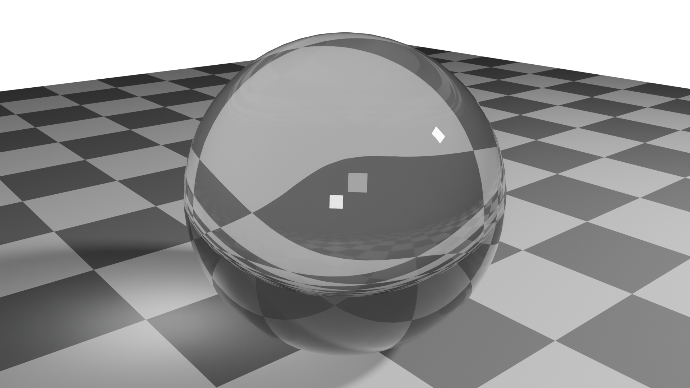
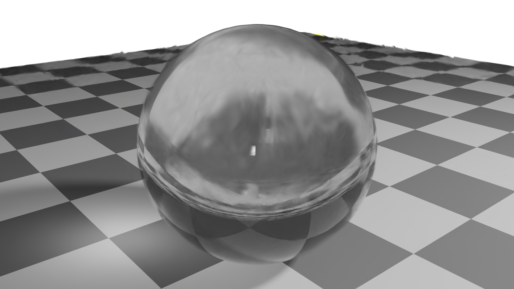
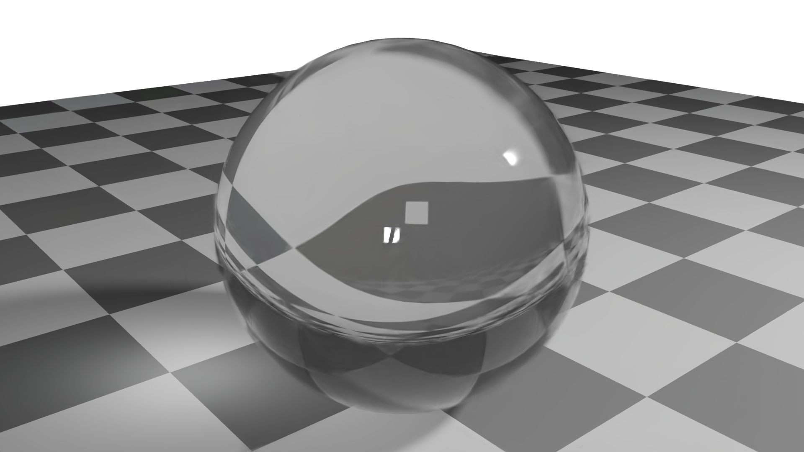
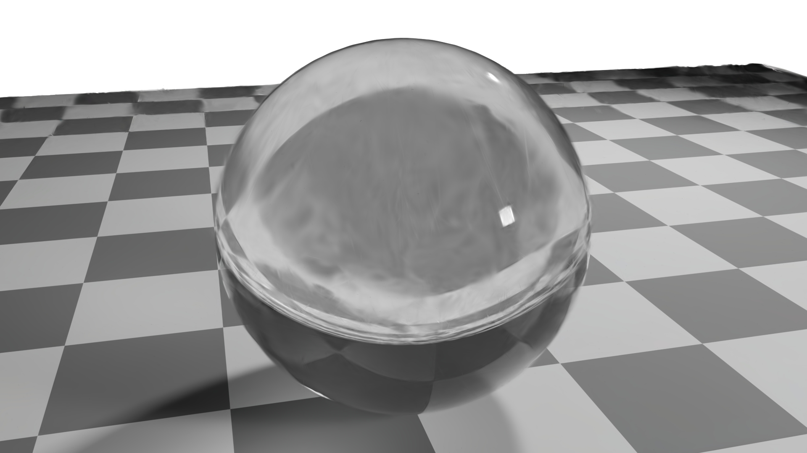
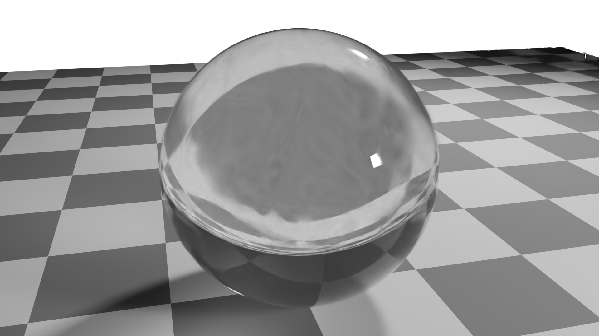

# Physics-Based Opacity Suppression for Transparent Object Rendering in 3D Gaussian Splatting

**OSS 4009 — Computer Vision | Carleton University | Winter 2026**
Owen Stewart · Dylan Gordon

---

## Demo Video

**Full reproduction walkthrough — watch before running:**

[](https://youtu.be/bRcr_rPFkQA)

> Full reproduction walkthrough of our physics-based glass fix for 3D Gaussian Splatting.
> Demonstrates environment setup on vast.ai, cloning the repository, injecting the fix
> into Nerfstudio, training on our synthetic glass sphere dataset, and evaluating
> quantitative results (PSNR, SSIM, LPIPS).

---

## Overview

This project identifies and fixes a well-known failure mode in 3D Gaussian Splatting
where transparent objects like glass render as cloudy opaque fog. We inject a
physics-based fix directly into Nerfstudio's Splatfacto pipeline using Schlick's
Fresnel approximation to suppress Gaussian opacity proportionally to the physical
transmittance of glass. Zero changes to training are required.

**Results on synthetic glass sphere dataset:**

| Metric | Baseline | Ours     | Improvement |
|--------|----------|----------|-------------|
| PSNR   | 28.09 dB | 31.60 dB | +3.51 dB    |
| SSIM   | 0.9583   | 0.9733   | +0.015      |
| LPIPS  | 0.1261   | 0.0833   | −34%        |

---
---

## Visual Results

---

### Best Case — Frame 0012 (Front-Facing View)

| Ground Truth | Baseline (No Fix) | Ours (Fixed) |
|:---:|:---:|:---:|
|  |  |  |

The baseline produces dense opaque fog where the glass should be transparent.
Our fix reveals the checkerboard pattern through the glass and recovers the
correct transparent appearance.

---

### Partial Fix — Frame 0030 (Grazing Angle View)

| Ground Truth | Baseline (No Fix) | Ours (Fixed) |
|:---:|:---:|:---:|
|  |  |  |

At shallow viewing angles our method shows partial improvement. Fresnel physics
correctly predicts high reflectance at grazing angles so opacity is intentionally
suppressed less. Full mirror-like reflection requires explicit reflection
rendering which is beyond the scope of a render-time injection.

---
---

## Repository Structure

```
README.md
code/
  splatfacto_edited.py     Our modified Splatfacto file with the glass fix
  inject_fix.py            Script to apply the fix to your nerfstudio install
dataset/
  images.zip               100 synthetic glass sphere renders (800x800 PNG)
  transforms_train.json    Camera poses — training split
  transforms_val.json      Camera poses — validation split
  transforms_test.json     Camera poses — test split
results/
  eval_no_fix.json      Quantitative metrics — baseline (no fix)
  eval_fixed.json       Quantitative metrics — our fix
  renders_no_fix/       Rendered frames from stock Splatfacto
  renders_fixed/        Rendered frames from our modified Splatfacto
PDF/
  report.pdf               IEEE-format project report
```

---

## Important Note on Running This Code

Nerfstudio **only runs on Linux with an NVIDIA GPU**. It cannot be run on:

- **Windows** — core dependencies require GCC build tools not available on Windows.
  WSL2 is listed as experimental and does not reliably support GPU passthrough.
- **Google Colab** — may work depending on the Colab instance. We recommend
  vast.ai for a guaranteed working environment.

All training and evaluation was completed on a rented Ubuntu Linux GPU instance
via [vast.ai](https://vast.ai) using the PyTorch template.

---

## Verified Environment

These are the exact versions used to produce all results:

```
OS:           Ubuntu Linux (kernel 5.15.0-139-generic)
Python:       3.12.13
PyTorch:      2.11.0+cu130
CUDA:         13.0
GPU:          NVIDIA RTX 3080
Nerfstudio:   1.1.5
gsplat:       1.4.0
```

---

## Step-by-Step Reproduction

The video above walks through every step below in real time.

---

### Step 1 — Rent a GPU on vast.ai

1. Go to [vast.ai](https://vast.ai) and create an account
2. Click **Search** in the left menu
3. Select template: **PyTorch (vast)**
4. Filter for an NVIDIA GPU with at least 10GB VRAM and 30GB disk space
5. Click **Rent** and wait for the instance to show **Running**
6. Click **Connect** — copy the SSH command shown:
   ```
   ssh root@XXX.XXX.XXX.XXX -p XXXXX
   ```

---

### Step 2 — Connect via VSCode

1. Install the **Remote - SSH** extension in VSCode
2. Press `Ctrl+Shift+P` → type **Remote-SSH: Connect to Host** → click it
3. Paste the SSH command from vast.ai
4. Select **Linux** when asked for platform
5. Wait ~30 seconds for VSCode to connect
6. Click **Open Folder** → type `/workspace` → click OK
7. Open terminal with `` Ctrl+` ``
8. You should see: `root@XXXXXXXX:/workspace$`

---

### Step 3 — Install Dependencies

```bash
pip install --upgrade pip
pip install nerfstudio
pip install gsplat
```

Verify everything installed:
```bash
ns-train --help
```

You should see a list of available training methods with no errors.

---

### Step 4 — Clone This Repository

```bash
git clone https://github.com/owen-stewart/nerfstudio-opacityfix.git
cd nerfstudio-opacityfix
```

---

### Step 5 — Unzip the Dataset

```bash
cd dataset
unzip images.zip
cd ..
```

Verify the images are there:
```bash
ls dataset/images/ | head -10
```

You should see image filenames listed.

---

### Step 6 — Apply the Fix

This is the key step. `inject_fix.py` finds where nerfstudio installed
`splatfacto.py`, backs up the original, and replaces it with our edited
version that contains the physics-based glass fix.

```bash
python3 code/inject_fix.py
```

Expected output:
```
Nerfstudio splatfacto: /path/to/nerfstudio/models/splatfacto.py
Our edited version:    /path/to/code/splatfacto_edited.py
Backup saved: /path/to/nerfstudio/models/splatfacto_original.py
SUCCESS — fix applied!
```

**What the fix does:** Injects Schlick's Fresnel approximation into
Splatfacto's `get_outputs()` method immediately before the rasterization
call. The injection is clearly marked in `code/splatfacto_edited.py`
between:
```python
# --- SPHERE GLASS FIX START ---
...
# --- SPHERE GLASS FIX END ---
```

---

### Step 7 — Train

```bash
ns-train splatfacto --data dataset blender-data
```

Training takes approximately 20–40 minutes depending on GPU. You will
see a progress bar with live PSNR updates. When complete, nerfstudio
prints the final metrics and saves the checkpoint.

---

### Step 8 — Find the Config Path

```bash
find . -name "config.yml" | tail -1
```

Copy the full path printed — you will use it in the next two steps.
It will look something like:
```
./outputs/dataset/splatfacto/2026-04-05_212600/config.yml
```

---

### Step 9 — Render Output Images

```bash
ns-render dataset \
  --load-config PATH_FROM_STEP_8 \
  --output-path renders/
```

Replace `PATH_FROM_STEP_8` with the config path from Step 8.
Rendered images will be saved to `renders/test/`.

> **Note:** If you encounter a PyTorch weights loading error, run this fix:
> ```python
> python3 -c "
> import site, os
> sp = site.getsitepackages()[0]
> path = os.path.join(sp, 'nerfstudio/utils/eval_utils.py')
> content = open(path).read()
> content = content.replace(
>     'torch.load(load_path, map_location=\"cpu\")',
>     'torch.load(load_path, map_location=\"cpu\", weights_only=False)')
> open(path, 'w').write(content)
> print('PyTorch fix applied')
> "
> ```
> Then rerun the render command.

---

### Step 10 — Evaluate Metrics

```bash
ns-eval \
  --load-config PATH_FROM_STEP_8 \
  --output-path metrics.json

cat metrics.json
```

Expected output:
```json
{
  "results": {
    "psnr": 31.60,
    "ssim": 0.9733,
    "lpips": 0.0833
  }
}
```

---

## How the Fix Works

The fix is implemented in `code/splatfacto_edited.py` and runs every
forward pass. It has 6 steps:

**Step 1 — View direction**
Compute normalised vector from camera to each Gaussian. Camera position
extracted from the camera-to-world matrix. Detached to prevent gradient
flow — forward-pass correction only.

**Step 2 — Radial surface normal (sphere-specific)**
Estimate surface normals using radial directions from scene center.
Center estimated as mean of all Gaussian positions. Exact for spheres —
incorrect for non-spherical objects such as cubes or prisms.

**Step 3 — Glass Gaussian identification**
Identify glass Gaussians using two heuristic filters:
- Distance gate — Gaussians within 70–130% of median radius (sphere shell)
- Flatness gate — removes near-spherical fog blobs (s_min/s_max < 0.6)

Both conditions must be satisfied. Output is a binary mask.

**Step 4 — Schlick Fresnel approximation**
Compute Fresnel reflectance: `F(θ) = F0 + (1−F0)(1−cosθ)^5`
F0 = 0.04 for glass/air interface (IOR 1.5).
Low reflectance face-on, high reflectance at grazing angles.

**Step 5 — Opacity suppression**
Suppress opacity of glass Gaussians proportional to physical transmittance:
`new_α = sigmoid(o) × T(θ) × 0.30`
T(θ) = 1 − F(θ). Scale factor 0.30 tuned via ablation study.
Non-glass Gaussians unchanged. Result converted back to logit space.

**Step 6 — Specular highlight (cosmetic)**
Add white specular tint to glass edges proportional to Fresnel value.
Applied to DC spherical harmonic coefficient with Y0 normalisation.
Cosmetic only — does not affect the transparency fix.

---

## Known Limitations

1. **Spherical geometry only** — the radial normal estimation is exact
   for spheres but does not generalise to flat-faced objects (glass cubes,
   windows, prisms).

2. **Grazing angle partial fix** — at shallow viewing angles Fresnel
   predicts low transmittance so opacity is intentionally suppressed less.
   The result reduces fog but cannot reproduce the sharp mirror-like
   reflection real glass shows at grazing angles.

---

## Related Work

| Paper | Venue | Approach vs Ours |
|-------|-------|-----------------|
| TransparentGS (Huang et al.) | ACM TOG 2025 | New Gaussian primitives + ray tracing — requires architectural changes |
| GlassGaussian (Cao et al.) | 2025 | Modified training pipeline |
| TSGS (Li et al.) | arXiv 2025 | Normal + de-lighting priors during training |
| TranSplat (Kim et al.) | arXiv 2025 | Surface embedding-guided 3DGS |

**Our approach is unique** — all published methods require architectural
changes or training modifications. Our fix is ~30 lines of PyTorch code
injected at render time with zero training changes.

---

## References

[1] Kerbl et al., "3D Gaussian Splatting for Real-Time Radiance Field Rendering," SIGGRAPH 2023

[2] Tancik et al., "Nerfstudio: A Modular Framework for Neural Radiance Field Development," SIGGRAPH 2023

[3] Schlick, "An Inexpensive BSDF Model for Physically-based Rendering," CGF 1994

[4] Huang et al., "TransparentGS: Fast Inverse Rendering of Transparent Objects with Gaussians," ACM TOG 2025

[5] Li et al., "TSGS: Improving Gaussian Splatting for Transparent Surface Reconstruction," arXiv 2025
